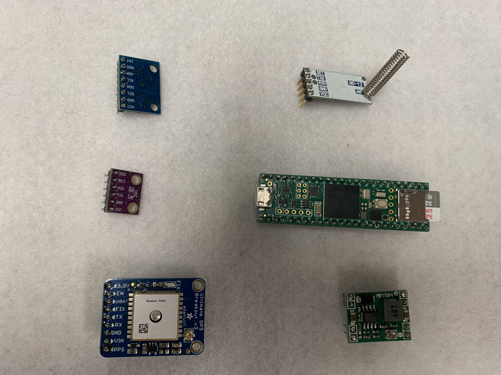
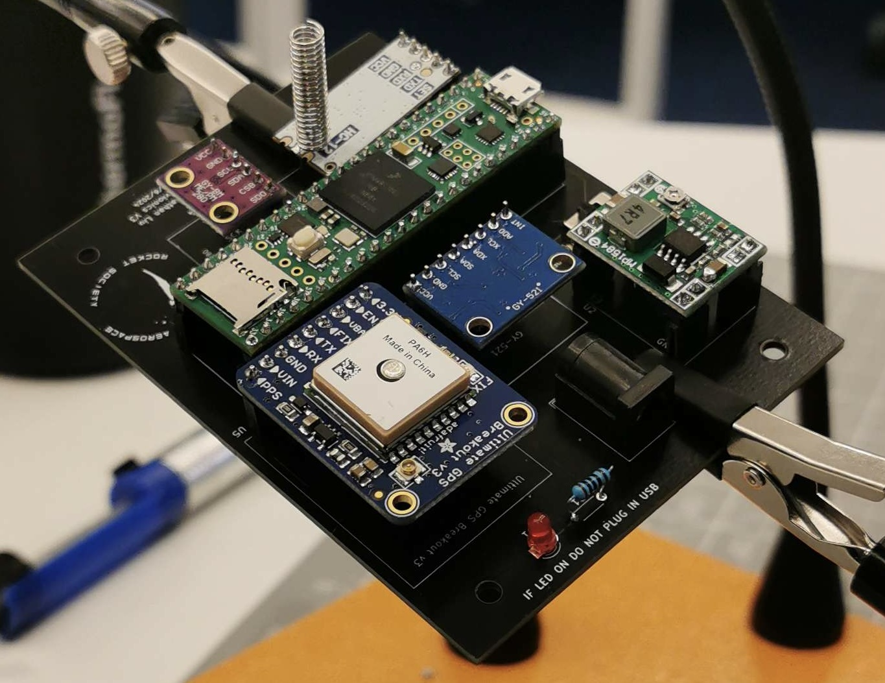

# How to set up your avionics 

## Hardware
DO NOT SOLDER THE COMPONENTS DIRECTLY TO THE BOARD. YOU MUST USE STAND OFF PINS.

### Step 1
This is the [PCB](../kits/photos/parts/pcb.jpg). Cut down the [stand off pins](photos/standoff.jpg) to the right size to line up with the holes on your PCB. You can use pliers to pull out the metal pins instead of cutting the small ones.

solder it

### Step 2
You are supplied a bunch of [pins](photos/pins.jpg). Solder the pins onto you [break out boards](photos/breakoutboards.jpg).
**The pins have to be soldered just as shown in the photo below.** Short side into the break out boards. Make sure the pins are at 90 degrees, and all the way in. Don't forget to solder the spring antenna onto the HC-12 in the *ANT* hole. (Don't worry about the GPS battery for now, unless you think you can figure it out. Don't lose the part though).

**NOTE!** The best way to solder the [voltage regulator](../kits/photos/parts/bucknswitch.jpg) is with just one pin on each corner. Yes there are 8 holes for pins, but just use the 4 outer most. (Yes the picture above has all the pins on it soldered. don't do that) You can solder the voltage regulator directly to the board. This is the only break out board you cam solder directly to the board.

### Step 2
This is the [PCB](../kits/photos/parts/pcb.jpg). Cut down the [stand off pins](photos/standoff.jpg) to the right size to line up with the holes on your PCB. 

### Step 3
Solder your barrel jack, switch, resistor, and LED directly to the board.

### Step 4 
Plug in all your components. It should look like this:

 **Never plug in the battery and the USB at the same time!**

## Software
- [Following this guide](https://www.pjrc.com/teensy/td_download.html), get the arduino IDE, add the teensy to additional boards manager and install teensyduino.
- Make sure you can run a blink test.
- Download the [flightcomputer](https://github.com/marstmu/flightcomputer) code from github. Go to src, then main.cpp, take that code and paste it into the arduino IDE and upload it.
- Open the serial monitor to view it, you should also be logging data to the SD card at this point.
### Setting your antenna channel
Each team gets their own antenna channel. Use the github code to change the channel. Program both of your antennas this way.