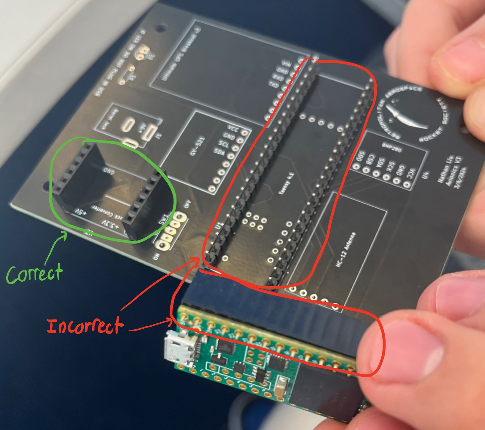
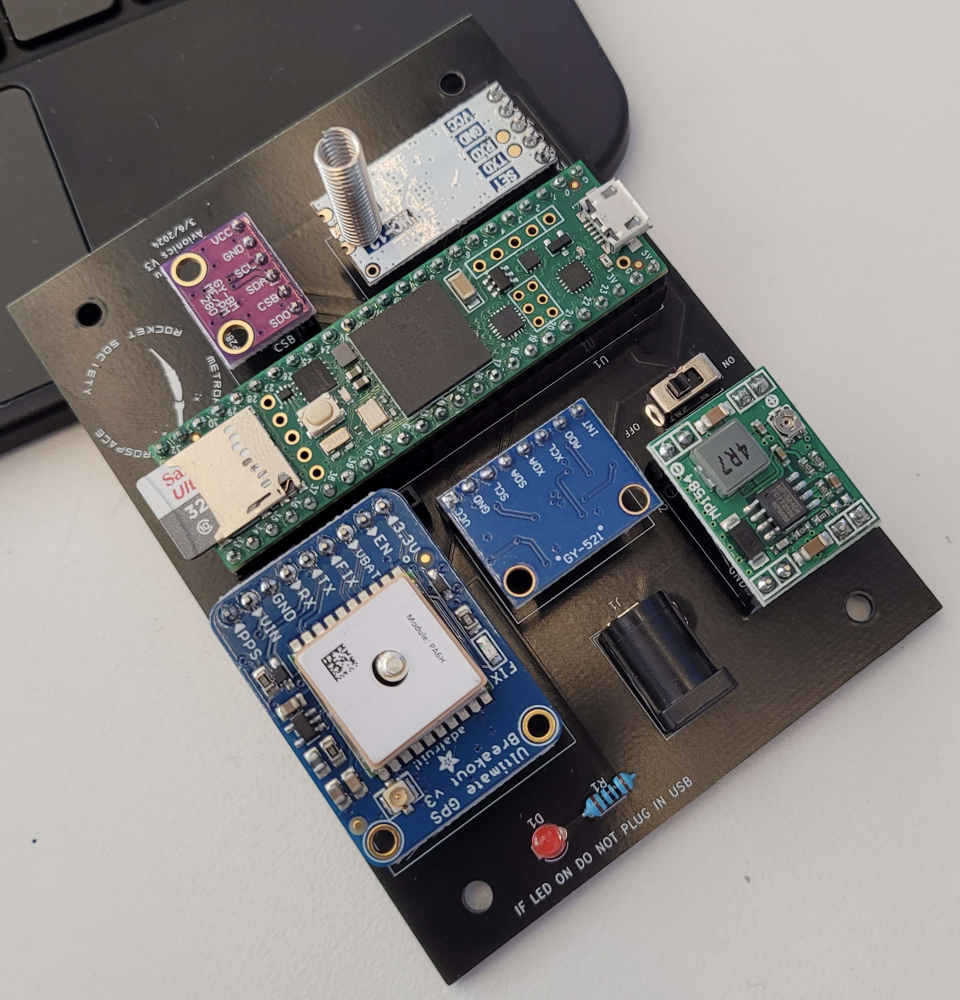

# How To Set Up Your Flight Computer
These are final flight computers! 
## Hardware Section
YOU MUST USE STAND OFF PINS. DO NOT SOLDER THE PARTS DIRECTLY TO THE BOARD

DO NOT PLUG IN THE BATTERY UNTIL THE AVIONICS SESSION YOU WILL FRY THE BOARD.

Read this whole thing briefly before you start soldering. 
### Step 1
This is the [PCB](../kits/photos/parts/pcb.jpg). Cut down the [stand off pins](photos/standoff.jpg) to the right size to line up with the holes on your PCB. You can use pliers to pull out the metal pins instead of cutting the small ones.

solder it

**This is incorrect in a few ways, do not do this:** 

### Step 2
You are supplied a bunch of [pins].
Solder the pins onto your [break out boards]. 
- Make sure you solder them on the correct side:  Zoom in on this image to see which side they they should be soldered 

- The Teensy only needs the outer pins soldered. Leave the ones in the middle unsoldered. 

Tips:
 - The short side of the [pins] go into the [break out boards].  Make sure the pins are at 90 degrees, and all the way in. 
 - Don't forget to solder the [spring antenna onto the HC-12](photos/antenna.jpg) in the *ANT* hole.
 - Don't worry about the [GPS battery](photos/gpsbattery.jpg) for now.
 - The best way to solder the [buck converter] is with just one pin on each outter corner. Yes there are 8 holes for pins, but just use the 4 outer most. Also this is the only [break out board] you can solder directly to the board.

### Step 3
Solder the barrel jack, switch, resistor, and LED (and [buck converter] if you want to) directly to the board.

### Step 4 
Plug in all your components. It should look like this:

### Step 5
Set the voltage level of the buck converter by screwing this until the downsteam voltage (use a multimeter) reads 3.3 volts.

 **Never plug in the battery and the USB at the same time!**
 Don't plug in the battery for now, we still have to set the [buck converter] to the right voltage which we will do at the avionics session.

## Software Section
- [Following this guide](https://www.pjrc.com/teensy/td_download.html), get the arduino IDE, add the teensy to additional boards manager and install the teensy loader.
- Make sure you can run a blink test.
- Download the [flightcomputer](https://github.com/marstmu/flightcomputer) code from github. Go to src, then main.cpp, take that code and paste it into the arduino IDE and upload it.
- Open the serial monitor to view it, you should also be logging data to the SD card at this point.
### Setting your antenna channel
Each team gets their own antenna channel. Use the [github code](https://github.com/marstmu/flightcomputerchannelselect) to change the channel. Program both of your antennas this way (One for hte ground station, and one for the flight computer).

[pins]: photos/pins.jpg

[break out boards]: photos/breakoutboards.jpg
[break out board]: photos/breakoutboards.jpg
[buck converter]: ../kits/photos/parts/bucknswitch.jpg