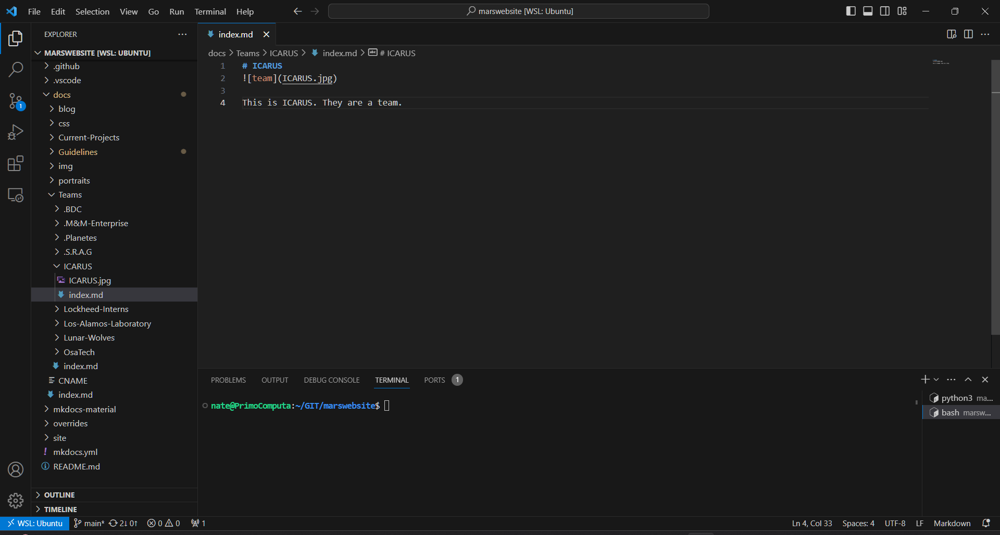
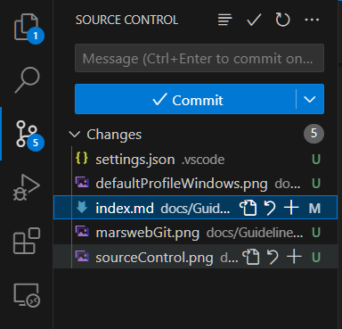

# How to contribute to this website

In this section we will be describing all the steps necessary in making a contribution to your teams section on this website. There will be a mac and a windows guide.

## Gettings Started
This website is hosted on [github]. 

[](https://squidfunk.github.io/mkdocs-material/)

[github]: repo_url

## Mac

## Windows
1. Have a computer with Windows 10/11.
2. [Install WSL] using Powershell (run as administrator):
```
wsl --install
```
3. [Install VS Code from this website.]

    **NOTE: From this point forward, all commands are run in the WSL terminal within VSCode, *not* Powershell or Windows Terminal. You can access this terminal by opening VSCode and clicking Terminal > New Terminal from the dropdown menus in the top left of the screen.**


4. Edit the following commands to include your email and username, then run to update your Linux distro:
```
sudo apt update
sudo apt upgrade
git config --global --get user.email
git config --global --get user.name

```
5. Run the following commands to install the necessary software.
    1. 
    ```
    sudo apt install python3-pip
    ```
    This installs Pip, a package manager used for the next few installations.
    2. 
    ```
    pip install mkdocs-material
    ```
    This installs MKDocs, the site generator we use to create in Markdown (which is itself a programming language of sorts).
    3. 
    ```
    echo 'export PATH=$PATH:/home/YOUR_USERNAME_HERE/.local/bin' >> ~/.bashrc
    ```
    This adds the MKDocs install folder to your path, which informs WSL where your install is, and how to make use of it. Don't forget to replace YOUR_USERNAME_HERE with the username you created in step 2. 
6. Make sure VSCode launches by default in WSL. To do this, hit ctrl+, on your keyboard to enter settings, and search for "default profile" at the top of the page. Find the setting for "Terminal › Integrated › Default Profile: Windows" and open the associated settings.json file. Paste the following line right below your workbench.colorTheme setting: ```"terminal.integrated.defaultProfile.windows": "Ubuntu (WSL)",```. The json file should look similar to this:

Once complete, save everything and restart VSCode. 
7. Run this entire block of code at once in your VSCode terminal:
```bash
type -p curl >/dev/null || (sudo apt update && sudo apt install curl -y)
curl -fsSL https://cli.github.com/packages/githubcli-archive-keyring.gpg | sudo dd of=/usr/share/keyrings/githubcli-archive-keyring.gpg \
&& sudo chmod go+r /usr/share/keyrings/githubcli-archive-keyring.gpg \
&& echo "deb [arch=$(dpkg --print-architecture) signed-by=/usr/share/keyrings/githubcli-archive-keyring.gpg] https://cli.github.com/packages stable main" | sudo tee /etc/apt/sources.list.d/github-cli.list > /dev/null \
&& sudo apt update \
&& sudo apt install gh -y
```
This installs GitHub inside your new Linux install which will allow you to fork, and eventually contribute to, the website. Check out [this link] for more information. 
8. Clone the repo & open it in VScode: 
```
git clone https://github.com/zeulewan/marswebsite.git
cd marswebsite
code .
```
If all went well, your interface should look a lot like this. **IMPORTANT: make sure the blue box in the bottom left corner says WSL: Ubuntu. If there are any issues with that, repeat step 6**


9. Run this command:
```
git config pull.rebase true
```
This instructs GitHub to merge your changes with others in the event someone makes changes to the main branch while you're still editing yours. 

10. You're all set! Make contributions to your teams' subfolder under marswebsite > docs > Teams. Once ready to publish to the website, click on source control (the third one in this menu): 

    

    Then type a commit message into this box that describes what changes you're trying to make to the website. Once complete, hit the big blue commit button:

    

    It's going to prompt you a few things, hit yes to everything including the popup that asks you to fork the repo. This allows you to publish your own version of the website which the MARS team can then review and combine into the main website. Click sync changes once the blue button changes.

11. Go to your own personal repo on GitHub and click contribute, like so. Click sync fork *before* contribute, only necessary if you see a message saying your branch is behind the main branch:

Sync fork will open up a new button called "create pull request". Once you press that, the MARS team will see your changes and be able to merge them onto the website!


[Install WSL]: https://learn.microsoft.com/en-us/windows/wsl/install
[Install VS Code from this website.]: https://code.visualstudio.com/
[this link]: https://github.com/cli/cli/blob/trunk/docs/install_linux.md