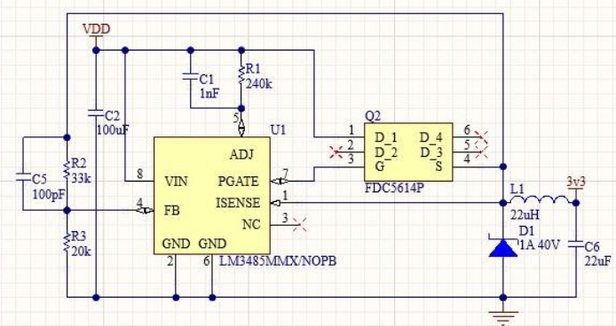
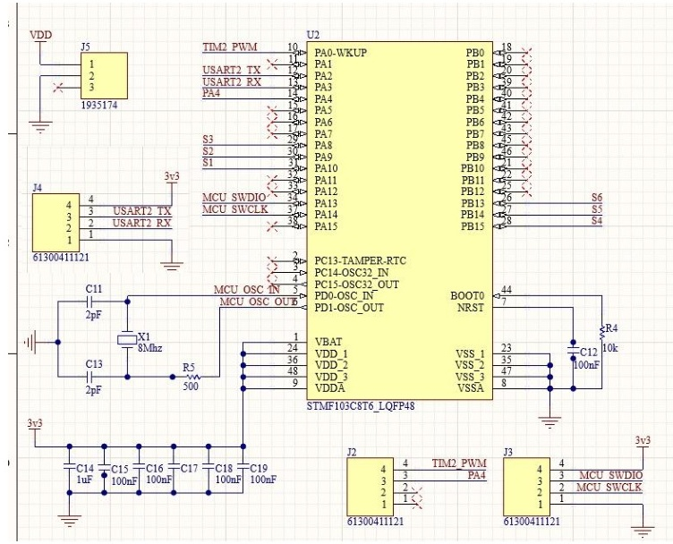
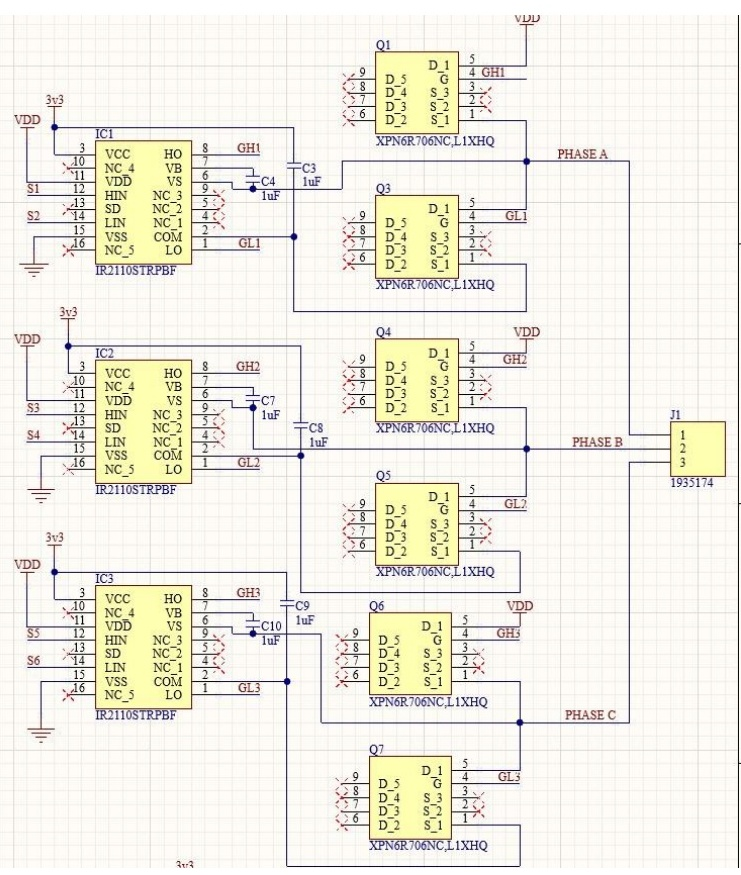
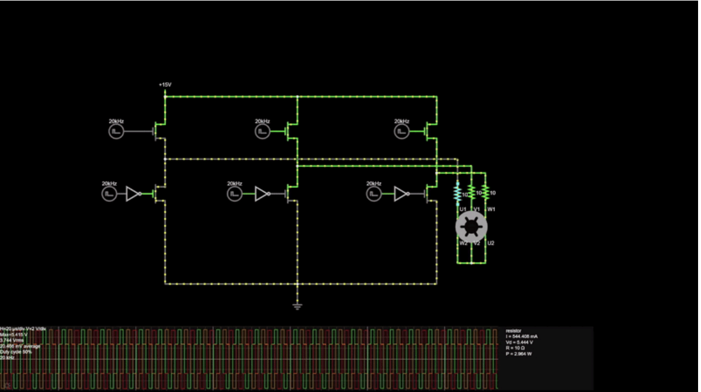

# Three-Phase Motor Controller

**By: Quentin Dela Torre.** [Altium Files](<quentin/stm32_drone - Quentin Dela Torre.zip>)

## Intro

This is an STM32F1-based motor controller for three-phase BLDC motors. 

## Hardware Subsystems

### Power Supply

- Provide 14.8 V to drive inverter circuit 
- Buck converter to step-down 14.8 V to 3.3 V for microcontroller

### Microcontroller

- Communicates with main controller via USART to control motor speed 
- Controls inverter high-side MOSFETs and low-side MOSFETs to create a three-phase signal using digital signals

### Three-phase Inverter

- Uses IGBT gate drivers to provide enough current to drive inverter MOSFETs via microcontroller GPIO pins 
- Uses three pairs of high-side MOSFETs and low-side MOSFETs to create each phase 

## Hardware Components

- **Gate driver (IR2110STRPBF):** Provides up to 2.5A to drive inverter MOSFETs 
- **Buck converter (LM3485MMX/NOPB):** 
    - Input range 4.5 V - 35 V 
    - Output range 1.242 V - Vin 
- **Microcontroller (STM32F103C8T6):** Provides USART, 6 GPIOs for each inverter MOSFET, TIM 
- **N-channel MOSFET (XPN6R706NC,L1XHQ):** Threshold voltage of 1.5 V, max drain current of 40 A 
- **8 MHz crystal oscillator:** To allow for high frequency three-phase signal 
- **Resistors, capacitors and inductors:** Chosen according to component documentation recommendations 

## PCB

Two layers (one for signal, one for ground) 

## Three-Phase Inverter Simulation

The MOSFETs in the inverter circuit are controlled by the microcontroller via PWM. 

From left to right, the high-side MOSFETs M1, M3, and M5 are 120 degrees out of phase from each other. 

Below, from left to right, the low-side MOSFETs M4, M6, and M2 are also out of phase with each other. Their gate inputs are opposite to the high-side MOSFET directly above. 

Below is the switching sequence of the inverter MOSFETs, where only two are activated every 60 degrees. 

  

The scope at the bottom side of the simulation shows the waveforms of each phase of the BLDC motor in a wye-configuration, due to the switching sequence of the inverter MOSFETs. 

## Things to Improve

- More prototyping before creating PCB 
- Component selection for footprint and requirements 
- PCB layout 
- Better system design and defined requirements 
- Better simulations
